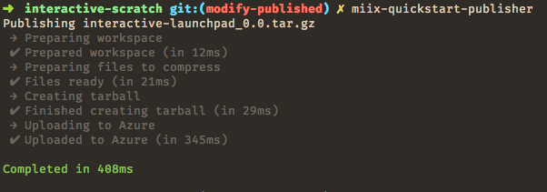

# cdk-quickstart-publisher

This is a helper script to publish quickstarts for cdk. Used internally within Mixer.

### How to use

0. `npm i -g @mixer/cdk-quickstart-publisher`
1. Set your `AZURE_STORAGE_CONNECTION_STRING` environment variable appropriately. [`direnv`](https://direnv.net/) is super useful for this.
2. Create a `.cdk-quickstart` file in your project that exports a list of file rules. Here's an [example](https://github.com/mixer/interactive-launchpad/blob/master/.cdk-quickstart).
3. `npm install -g @mcph/cdk-quickstart-publisher`
4. Run `cdk-quickstart-publisher` to do the thing!

